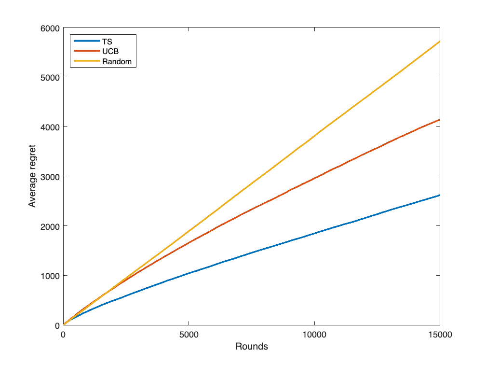
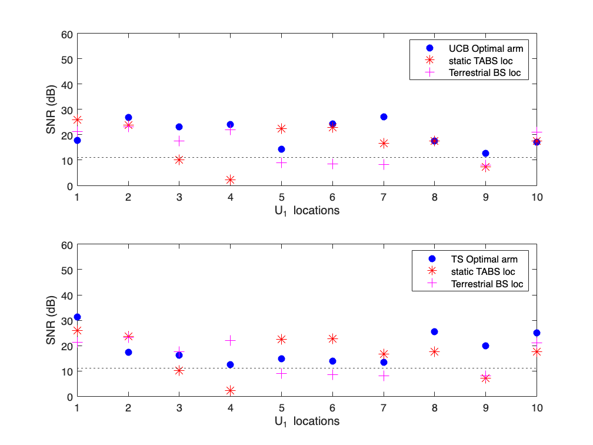
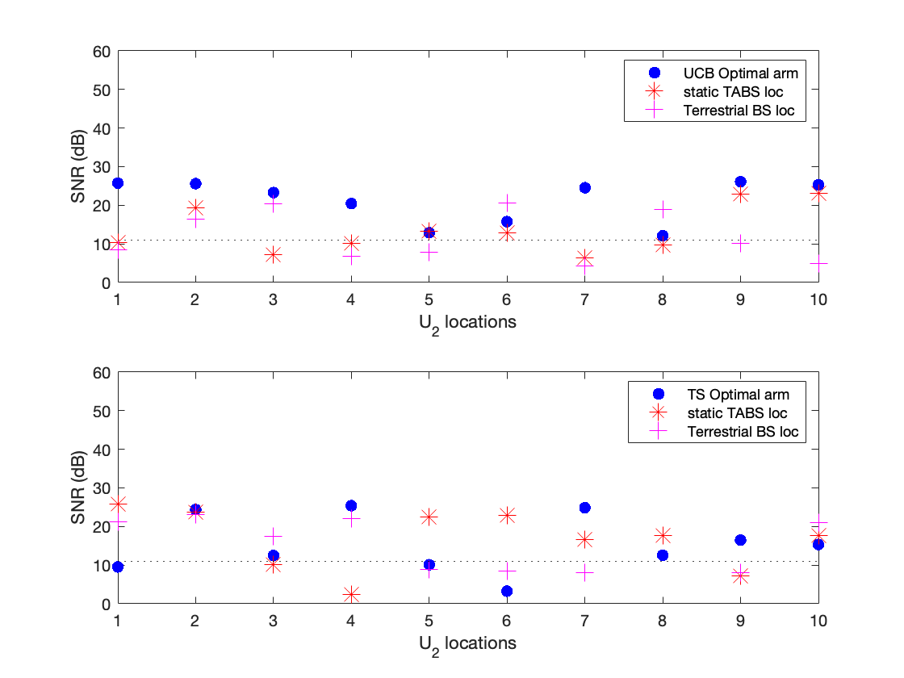
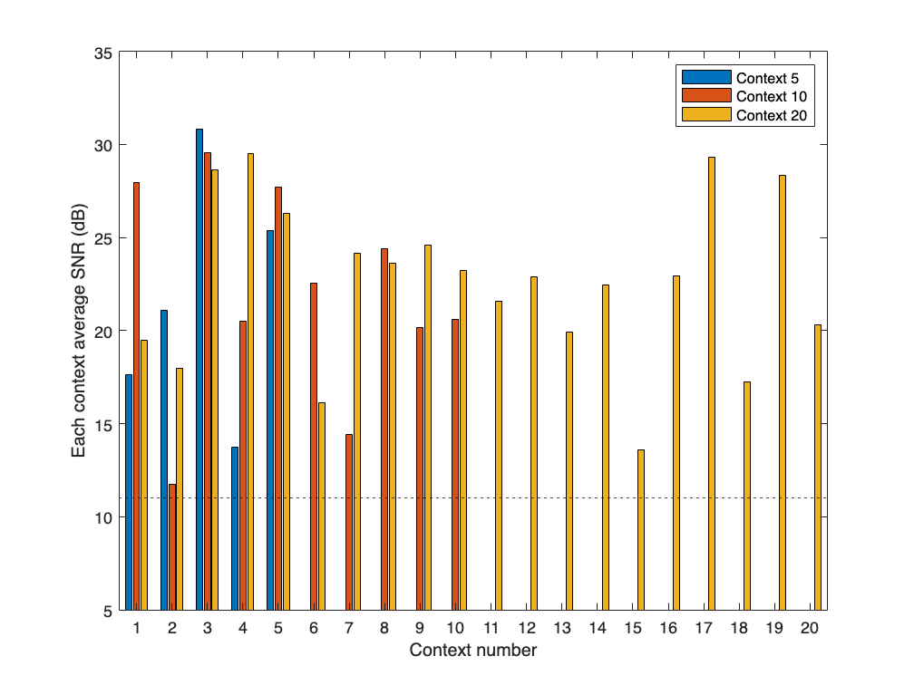
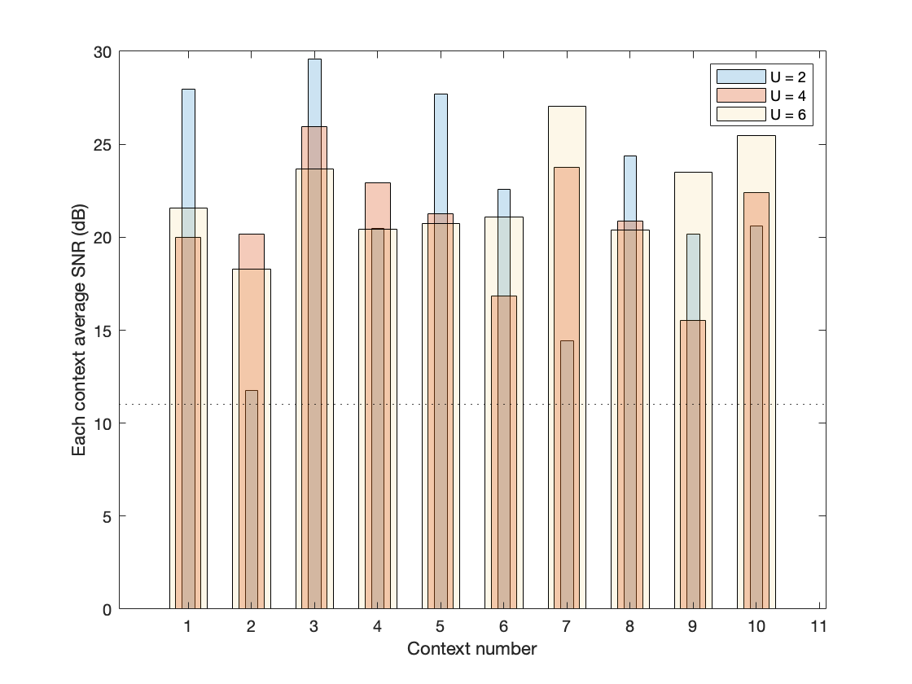
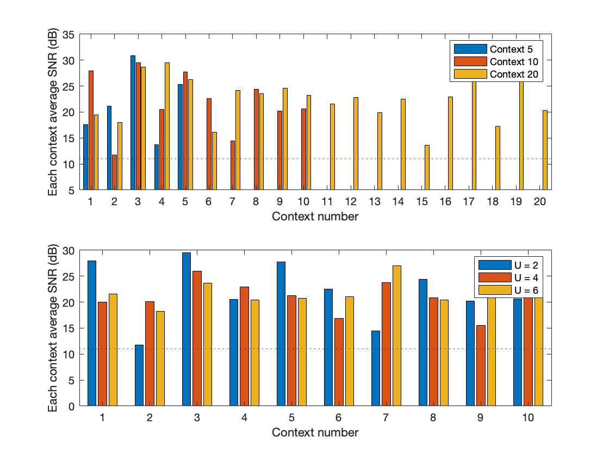

# Simulation code for creating random locations and calculating path loss from uav\_ue to tethered base station random locations

**Authors**: Pravallika Katragunta, Michel Barbeau, Joaquin Garcia-Alfaro, Evangelos Kranakis, Venkata Srinivas Kothapalli


**References:**


[waypointTrajectory](https://www.mathworks.com/help/nav/ref/waypointtrajectory-system-object.html)


Saad, W., Bennis, M., Mozaffari, M., & Lin, X. (2020). Wireless Communications and Networking for Unmanned Aerial Vehicles. Cambridge University Press.

```matlab
close all;
clear all;
```

***UAV locations limit***

```matlab
uav_xlim = -250:10:250;
uav_ylim = -250:10:250;
uav_zlim = 300:10:400;
```

***Tethered base station (TBS) locations limit***

```matlab
%  surf(x,y,z)
h = 90; %height of the building (m)
tbs_originpt = [0 0 h]; %origin where power source for TBS is drawn
```
# elevation angle
```matlab
theta = linspace(0, pi, 10); %linear space angles of theta. Here 10 is the number of theta angles
```
# azimuthal angle
```matlab
phi = linspace(-pi, pi, 10); % Here 10 is the number of phi angles
```
# radius
```matlab
r = linspace(1,120,1); %maximum altitude of tbs
[theta, phi] = meshgrid(theta, phi);
```
# convert spherical to cartesian coordinates
```matlab
x = r .* cos(theta) .* cos(phi) + tbs_originpt(1);
y = r .* cos(theta) .* sin(phi) + tbs_originpt(2);
z = r .* sin(theta) + tbs_originpt(3);
tb = [x,y,z];
% %  code to generate a set of cartesian TBS locations
tbloc = []
```

```matlabTextOutput
tbloc =

     []
```

```matlab
for i=1:size(x,1)
    for j=1:size(x,2)
         tbloc = [tbloc;[x(i,j) y(i,j) z(i,j)]];
    end
end
```

***Creating arrays for cartesian coordinates for TBS locations and uav locations***

```matlab
uavloc = [];
% tbloc = [];
for i = 1:length(uav_xlim)
    for j = 1:length(uav_ylim)
        for k = 1:length(uav_zlim)
            uavloc = [uavloc;[uav_xlim(i),uav_ylim(j),uav_zlim(k)]];
        end
    end
end
```

***Selecting 10 random locations of UAV1***

```matlab
Num_context = 10;
  uav1_IDX = randperm(size(uavloc,1));
uav1_RandomRows = uavloc(uav1_IDX(1:Num_context),:);
save('uav1_locations.mat','uav1_RandomRows');
% load 'uav1_locations.mat';
% uav1_IDX = randperm(size(uavloc,1)- Num_context,1);% uav1_IDX = randperm(size(uavloc,1)-Num_context,1); 
% uav1_RandomRows = uavloc(uav1_IDX:uav1_IDX+Num_context-1,:); % uavloc(uav1_IDX:uav1_IDX+Num_context,:); 
```

 ***Selecting 10 random locations of UAV2***

```matlab
  %selecting uav2 random locations
uav2_IDX = randperm(size(uavloc,1));
uav2_RandomRows = uavloc(uav2_IDX(1:Num_context),:);
save('uav2_locations.mat','uav2_RandomRows');
% load 'uav2_locations.mat';
% uav2_IDX = randperm(size(uavloc,1)- Num_context,1);% uav1_IDX = randperm(size(uavloc,1)-Num_context,1); 
% uav2_RandomRows = uavloc(uav2_IDX:uav2_IDX+Num_context-1,:); % uavloc(uav1_IDX:uav1_IDX+Num_context,:); 
```

***Selecting 10 random locations of UAV3***

```matlab
  %selecting uav2 random locations
uav3_IDX = randperm(size(uavloc,1));
uav3_RandomRows = uavloc(uav2_IDX(1:Num_context),:);
save('uav3_locations_c10.mat','uav2_RandomRows');
% load 'uav3_locations_c10.mat';
% uav2_IDX = randperm(size(uavloc,1)- Num_context,1);% uav1_IDX = randperm(size(uavloc,1)-Num_context,1); 
% uav2_RandomRows = uavloc(uav2_IDX:uav2_IDX+Num_context-1,:); % uavloc(uav1_IDX:uav1_IDX+Num_context,:); 
```

```matlab

figure(1)
grid on
hold on
% Plot generated positions and specified waypoints.
h1 = plot3(tbloc(:,1),tbloc(:,2),tbloc(:,3),'b.');
hold on;
%plot3(uav1_pos(:,1),uav1_pos(:,2),uav1_pos(:,3),'r-' ,uav1_wps(:,1),uav1_wps(:,2),uav1_wps(:,3), 'b.')
%plot3(uav2_pos(:,1),uav2_pos(:,2),uav2_pos(:,3),'m-' ,uav2_wps(:,1),uav2_wps(:,2),uav2_wps(:,3), 'b.')
h2 = plot3(uav1_RandomRows(:,1),uav1_RandomRows(:,2),uav1_RandomRows(:,3),'cyan-',uav1_RandomRows(:,1),uav1_RandomRows(:,2),uav1_RandomRows(:,3),'cyan.');
hold on;
h3 = plot3(uav2_RandomRows(:,1),uav2_RandomRows(:,2),uav2_RandomRows(:,3),'magenta-',uav2_RandomRows(:,1),uav2_RandomRows(:,2),uav2_RandomRows(:,3),'magenta.');
hold on;
h4 = plot3(uav3_RandomRows(:,1),uav3_RandomRows(:,2),uav3_RandomRows(:,3),'magenta-',uav3_RandomRows(:,1),uav3_RandomRows(:,2),uav3_RandomRows(:,3),'magenta.');
%title('Random location selection')
 xlabel(' !!!EQ_1!!! ','Interpreter','latex')
 ylabel(' !!!EQ_2!!! ','Interpreter','latex')
 zlabel(' !!!EQ_3!!! ','Interpreter','latex')
 legend([h1,h2(1),h3(1)],"TABS","U_1","U_2","U_3",'Location','northeast');
```

```matlabTextOutput
Warning: Ignoring extra legend entries.
```

 **Create Actions** 

```matlab
A = 1: length(tbloc);
```

```matlabTextOutput
Warning: Error occurred while executing the listener callback for event POST_REGION defined for class matlab.internal.language.RegionEvaluator:
Error using LiveEditorEvaluationHelperE1886792292
Unexpected type in OutputPackager.packageOneOutput: UncaughtError.
Dump of evalStruct:
       type: 'UncaughtError'
    payload: [1x1 struct]
      stack: [19x1 struct]

Payload of evalStruct:
                     UncaughtErrorEvent: [1x1 struct]
    UncaughtErrorEvent_RequestIdAdapter: [1x1 struct]
                              exception: [1x1 struct]
                  isRecursionLimitError: 0
```

```matlab
Actions = strcat('goto',arrayfun(@(a)num2str(a),A,'uni',0))
```

```matlabTextOutput
Actions = 1x100 cell
'goto1'     'goto2'     'goto3'     'goto4'     'goto5'     'goto6'     'goto7'     'goto8'     'goto9'     'goto10'    'goto11'    'goto12'    'goto13'    'goto14'    'goto15'    'goto16'    'goto17'    'goto18'    'goto19'    'goto20'    'goto21'    'goto22'    'goto23'    'goto24'    'goto25'    'goto26'    'goto27'    'goto28'    'goto29'    'goto30'    

```

**No. of Iterations**

```matlab
rounds = 15000;
k = length(Actions); % Action length
N = length(uav1_RandomRows); % N is total no.of contexts
threashold = 11;
```

```matlab
count_ran = zeros(N,k); % no. of times each action is taken for random walk
```

```matlab
sum_rewards_ran = zeros(N,k); % sum of rewards for random walk
Q_ran = zeros(N,k); % average reward for random walk

reward = zeros(length(uav1_RandomRows)); % reward stored for waypoint
reward_ran = zeros(length(uav1_RandomRows)); % reward stored for random walk
context_rounds = ones(length(uav1_RandomRows))*rounds;


best_arm_ran = zeros(N,rounds); % selecting best arm for random walk
best_Q_ran = zeros(N,rounds); % best average reward for waypoint
```

**Random Sampling\-Random location selection**

```matlab
 %selecting tbs random locations
tbs_IDX = randperm(size(tbloc,1));
tbs_RandomRows = tbloc(tbs_IDX(1:Num_context),:);
% tbs_rand = randi(1,length(tbloc));
rand_ran_uav1_snr = zeros(k,length(uav1_RandomRows)); % calculate snr for tbs and uav1 random selection
rand_ran_uav2_snr = zeros(k,length(uav2_RandomRows)); % calculate snr for tbs and uav2 random selection
rand_ran_cumulative_reward = zeros(N,rounds); % cumulative reward for random selection

%  avg_rand_regret = zeros(N,rounds);
% avg_rand_regret_stat = zeros(N,rounds);
rand_ran_best_reward = zeros(N,rounds);
for n = 1:N
    for j = 1: rounds
        if j ==1
            rand_ran_best_reward(n,j) = 1;
        else
            rand_ran_best_reward(n,j) = rand_ran_best_reward(n,j-1)+1;
        end      
    end
end
tic
for n = 1:N
    for i = 1:rounds
        rand_ran_uav1_snr(i,n) = compute_snr(tbs_RandomRows(n,:),uav1_RandomRows(n,:));
        rand_ran_uav2_snr(i,n) = compute_snr(tbs_RandomRows(n,:),uav2_RandomRows(n,:));
         if (rand_ran_uav1_snr(i,n) >=threashold) && (rand_ran_uav2_snr(i,n) >=threashold)
                rand_ran_reward = 1;
        else
                rand_ran_reward = 0;
         end
                if i == 1
                    rand_ran_cumulative_reward(n,i) = rand_ran_reward;
                else 
                    rand_ran_cumulative_reward(n,i) = rand_ran_cumulative_reward(n,i-1)+rand_ran_reward;
                end
    end
    
end
rand_ran_regret = rand_ran_best_reward - rand_ran_cumulative_reward;
avg_rand_ran_regret = mean(rand_ran_regret);
toc
```

```matlabTextOutput
Elapsed time is 18.965644 seconds.
```

**UCB**

```matlab
ucb_ran_sum_rewards = zeros(N,k); % sum of the rewards
ucb_ran_Q = zeros(N,k);    % record average reward for waypoint
ucb_ran_count = zeros(N,k); % no. of times each action is taken for waypoint mobility
ucb_ran_best_arm = zeros(N,rounds); % selecting best arm for waypoint
ucb_ran_best_Q = zeros(N,rounds); % total best average reward for waypoint
uav1_snr = zeros(k,length(uav1_RandomRows)); % to store uav1_snr values
uav2_snr = zeros(k,length(uav2_RandomRows)); % to store uav2_snr values
ucb_ran_cumulative_reward = zeros(N, rounds);
ucb_ran_best_reward = zeros(N,rounds);
% avg_ucb_wb_stat = zeros(N,rounds);
%  avg_ucb_wp_regret = zeros(n,rounds);

for n = 1:N
    for j = 1: rounds
        if j ==1
            ucb_ran_best_reward(n,j) = 1;
        else
            ucb_ran_best_reward(n,j) = ucb_ran_best_reward(n,j-1)+1;
        end      
    end
end
% for s = 1: N
tic
for n = 1:N % loop over each context
%     rounds = context_rounds(n); 
    for b = 1:rounds % loop over each round
        Arm_ran = UCB(b,k,n,ucb_ran_Q,ucb_ran_count);
        ucb_ran_count(n,Arm_ran) = ucb_ran_count(n,Arm_ran)+1;
        uav1_snr(Arm_ran,n) = compute_snr(tbloc(Arm_ran,:),uav1_RandomRows(n,:));
        uav2_snr(Arm_ran,n) = compute_snr(tbloc(Arm_ran,:),uav2_RandomRows(n,:));

        if (uav1_snr(Arm_ran,n) >=threashold) && (uav2_snr(Arm_ran,n) >=threashold)
                ucb_ran_reward = 1;
        else
                ucb_ran_reward = 0;
        end
            if b == 1
               ucb_ran_cumulative_reward(n,b) = ucb_ran_reward;
            else 
               ucb_ran_cumulative_reward(n,b) = ucb_ran_cumulative_reward(n,b-1)+ucb_ran_reward;
            end
          
            ucb_ran_sum_rewards(n,Arm_ran) = ucb_ran_sum_rewards(n,Arm_ran)+ucb_ran_reward;

            ucb_ran_Q(n,Arm_ran) = ucb_ran_sum_rewards(n,Arm_ran)/ucb_ran_count(n,Arm_ran);
            [ucb_ran_best_Q(n,b),ucb_ran_best_arm(n,b)] = max(ucb_ran_Q(n,:));
    end
end
toc
```

```matlabTextOutput
Elapsed time is 20.894161 seconds.
```

```matlab
ucb_ran_regret = ucb_ran_best_reward - ucb_ran_cumulative_reward;
avg_ucb_ran_regret = mean(ucb_ran_regret);

```

**Thomson sampling\-Random location selection**

```matlab
ts_ran_count = zeros(N,k); % no. of times each action is taken for waypoint mobility
ts_ran_Q = zeros(N,k); % average reward for thompson sampling
ts_ran_best_Q = zeros(N,rounds); % total best average reward for waypoint
ts_ran_sum_rewards = zeros(N,k); % sum rewards for thompson sampling
ts_ran_best_arm = zeros(N,rounds); % selecting best arm for thomspon sampling
ts_ran_cumulative_reward = zeros(N, rounds);
ts_ran_best_reward = zeros(N,rounds);
%  avg_ts_wp_regret = zeros(N,rounds);
ran_alpha = ones(k,N); % Initialize the alpha value as 1 for all arms
ran_beta = ones(k,N); % Initialize the beta value as 1 for all arms
for n = 1:N
    for j = 1: rounds
        if j ==1
            ts_ran_best_reward(n,j) = 1;
        else
            ts_ran_best_reward(n,j) = ts_ran_best_reward(n,j-1)+1;
        end      
    end
end
tic
for n = 1:N % loop over each context
%     rounds = context_rounds(n); 
    for t = 1:rounds % loop over each round
        TS_ran_Arm = thompson_sampling(ran_alpha(:,n),ran_beta(:,n),k);
        ts_ran_count(n,TS_ran_Arm) = ts_ran_count(n,TS_ran_Arm)+1;
        uav1_snr(TS_ran_Arm,n) = compute_snr(tbloc(TS_ran_Arm,:),uav1_RandomRows(n,:));
        uav2_snr(TS_ran_Arm,n) = compute_snr(tbloc(TS_ran_Arm,:),uav2_RandomRows(n,:));
        if (uav1_snr(TS_ran_Arm,n) >=threashold) && (uav2_snr(TS_ran_Arm,n) >=threashold)
                ts_ran_reward = 1;
        else
                ts_ran_reward = 0;
        end

        ts_ran_sum_rewards(n,TS_ran_Arm) = ts_ran_sum_rewards(n,TS_ran_Arm)+ts_ran_reward;
        ts_ran_Q(n,TS_ran_Arm) = ts_ran_sum_rewards(n,TS_ran_Arm)/ts_ran_count(n,TS_ran_Arm);
        [ts_ran_best_Q(n,t),ts_ran_best_arm(n,t)] = max(ts_ran_Q(n,:));

        if ts_ran_reward == 1
            ran_alpha(TS_ran_Arm,n) = ran_alpha(TS_ran_Arm,n)+1;
        else
            ran_beta(TS_ran_Arm,n) = ran_beta(TS_ran_Arm,n)+1;
        end

         if t == 1
               ts_ran_cumulative_reward(n,t) = ts_ran_reward;
         else 
               ts_ran_cumulative_reward(n,t) = ts_ran_cumulative_reward(n,t-1)+ts_ran_reward;
         end
    end
    
end
toc
```

```matlabTextOutput
Elapsed time is 56.250729 seconds.
```

```matlab
ts_ran_regret = ts_ran_best_reward - ts_ran_cumulative_reward;
avg_ts_ran_regret = mean(ts_ran_regret);
```

```matlab
best_arms = zeros(N,1);
best_arms_ucb = zeros(N,1);
optimal_tabs_loc = zeros(N,3);
optimal_tabs_loc_ucb = zeros(N,3);
opt_uav1_snr = zeros(N,1);
opt_uav2_snr = zeros(N,1);
opt_uav1_snr_ucb = zeros(N,1);
opt_uav2_snr_ucb = zeros(N,1);
stat_uav1_snr = zeros(N,1);
stat_uav2_snr = zeros(N,1);
bs_uav1_snr = zeros(N,1);
bs_uav2_snr = zeros(N,1);
bs = [0 0 25];
for i = 1:N
    best_arms(i,1) = ts_ran_best_arm(i,end);
    best_arms_ucb(i,1) = ucb_ran_best_arm(i,end);
    optimal_tabs_loc(i,:) = tbloc(best_arms(i,1),:);
    optimal_tabs_loc_ucb(i,:) = tbloc(best_arms_ucb(i,1),:);
    opt_uav1_snr(i,1) = compute_snr(optimal_tabs_loc(i,:),uav1_RandomRows(i,:));
    opt_uav2_snr(i,1) = compute_snr(optimal_tabs_loc(i,:),uav2_RandomRows(i,:));
    opt_uav1_snr_ucb(i,1) = compute_snr(optimal_tabs_loc_ucb(i,:),uav1_RandomRows(i,:));
    opt_uav2_snr_ucb(i,1) = compute_snr(optimal_tabs_loc_ucb(i,:),uav2_RandomRows(i,:));
end
for i = 1:N
    stat_uav1_snr(i,1) = compute_snr(tbloc(10,:),uav1_RandomRows(i,:));
    stat_uav2_snr(i,1) = compute_snr(tbloc(10,:),uav2_RandomRows(i,:));
    bs_uav1_snr(i,1) = compute_snr(bs(1,:),uav1_RandomRows(i,:));
    bs_uav2_snr(i,1) = compute_snr(bs(1,:),uav2_RandomRows(i,:));
end

Avg_opt_uav1 = mean(opt_uav1_snr)
```

```matlabTextOutput
Avg_opt_uav1 = 18.9847
```

```matlab
Avg_opt_uav2 = mean(opt_uav2_snr)
```

```matlabTextOutput
Avg_opt_uav2 = 15.4364
```

```matlab
Avg_stat_uav1 = mean(stat_uav1_snr)
```

```matlabTextOutput
Avg_stat_uav1 = 16.6349
```

```matlab
Avg_stat_uav2 = mean(stat_uav2_snr)
```

```matlabTextOutput
Avg_stat_uav2 = 13.5464
```

```matlab

% opt_uav1_snr = compute_snr(optimal_tabs_loc(1,:),uav1_RandomRows(1,:));
% opt_uav2_snr = compute_snr(optimal_tabs_loc(1,:),uav2_RandomRows(1,:));
% optimal_tabs_loc = tbloc(best_arms(1,1),:);
```


**Plot Average mean regret over context\- Random location selection**

```matlab
figure(4)
plot(avg_ts_ran_regret,'LineWidth',2);
hold on
plot(avg_ucb_ran_regret,'LineWidth',2);
hold on
plot(avg_rand_ran_regret,'LineWidth',2);
hold off
legend("TS","UCB","Random",'Location','northwest');
%title('Avegare Regret over Context-Random Location Selection');
ylabel('Average regret');
xlabel('Rounds');
```




**SNR for TS optimal arms for U1 and U2**

```matlab
% figure(10)
% subplot(2,1,1)
% %x = 1:10;
% %stem(x,[opt_uav1_snr';stat_uav1_snr']);
% %stem(opt_uav1_snr)
%  plot(opt_uav1_snr,'.','markersize',20,'color','blue');
% hold on
% %stem(stat_uav1_snr)
%  plot(stat_uav1_snr,'*','markersize',10,'color','red');
%  plot(bs_uav1_snr,'+','markersize',10,'color','green');
% ylim([5 60])
% yline(threashold,':r','Color','black')
% % yline(threashold,':r','Color','black')
% % opt_uav1_snr.Color = 'red'
% % stat_uav1_snr.Color = 'black'
% xlabel('U1 locations')
% ylabel('SNR (dB)')
% legend("TS Optimal arm","static TABS loc");
% hold off
% subplot(2,1,2)
% %x=1:10;
% %stem(opt_uav2_snr);
%  plot(opt_uav2_snr,'.','markersize',20,'color','blue');
% hold on
% %stem(stat_uav2_snr);
%  plot(stat_uav2_snr,'*','markersize',10,'color','red');
%  plot(bs_uav2_snr,'+','markersize',10,'color','green');
% ylim([5 60])
% % yline(threashold,':r','SNR Threshold','Color','black')
% yline(threashold,':r','Color','black')
% xlabel('U2 locations')
% ylabel('SNR (dB)')
% legend("TS Optimal arm","static TABS loc","Terrestrial BS");
```

```matlab
% figure(11)
% subplot(3,1,1)
% boxplot(rand_ran_regret');
% %title('Random Sampling');
% ylabel('Regret');
% xlabel('(a) Random sampling');
% 
% subplot(3,1,2);
% boxplot(ucb_ran_regret');
% %title('UCB');
% ylabel('Regret');
% xlabel('(b) UCB sampling');
% 
% subplot(3,1,3);
% boxplot(ts_ran_regret');
% %title('Thompson Sampling');
% ylabel('Regret');
% xlabel('(c) Thompson sampling');
```


**SNR for UCB optimal arms for U1 and U2**

```matlab
% figure(12)
% subplot(2,1,1)
% %x = 1:10;
% %bar(x,[opt_uav1_snr_ucb';stat_uav1_snr']);
% stem(opt_uav1_snr_ucb,'LineStyle',':')
% % plot(opt_uav1_snr_ucb,'.','markersize',20,'color','blue');
% hold on 
% stem(stat_uav1_snr,'LineStyle',':')
% % plot(stat_uav1_snr,'.','markersize',20,'color','red');
% ylim([0 60])
% yline(threashold,':r','Color','black')
% xlabel('U_1 locations')
% ylabel('SNR (dB)')
% legend("UCB Optimal arm","static TABS loc");
% hold off
% subplot(2,1,2)
% %x=1:10;
% %bar(x,[opt_uav2_snr_ucb';stat_uav2_snr']);
% stem(opt_uav2_snr_ucb)
% % plot(opt_uav2_snr_ucb,'.','markersize',20,'color','blue');
% hold on
% stem(stat_uav2_snr)
% % plot(stat_uav2_snr,'.','markersize',20,'color','red');
% ylim([0 60])
% hold on
% yline(threashold,':r','Color','black')
% xlabel('U_2 locations')
% ylabel('SNR (dB)')
% legend("UCB Optimal arm","static TABS loc");
```

 **SNR comparison for U1 locations** 

```matlab
% hold off
figure(13)
subplot(2,1,1)
%x = 1:10;
% bar([opt_uav1_snr_ucb';stat_uav1_snr']);
plot(opt_uav1_snr_ucb,'.','markersize',20,'color','blue');
hold on 
plot(stat_uav1_snr,'*','markersize',10,'color','red');
hold on
plot(bs_uav1_snr,'+','markersize',10,'color','magenta');
ylim([0 60])
hold on
yline(threashold,':r','Color','black')
xlabel('U_1 locations')
ylabel('SNR (dB)')
legend("UCB Optimal arm","static TABS loc","Terrestrial BS loc");
subplot(2,1,2)
%x=1:10;
% bar([opt_uav1_snr';stat_uav1_snr']);
plot(opt_uav1_snr,'.','markersize',20,'color','blue');
hold on
plot(stat_uav1_snr,'*','markersize',10,'color','red');
hold on
plot(bs_uav1_snr,'+','markersize',10,'color','magenta');
ylim([0 60])
hold on
yline(threashold,':r','Color','black')
xlabel('U_1 locations')
ylabel('SNR (dB)')
legend("TS Optimal arm","static TABS loc","Terrestrial BS loc");
```



**SNR comparison for U2 locations**

```matlab
figure(14)
subplot(2,1,1)
% x = 1:10;
% bar([x,opt_uav2_snr_ucb';stat_uav2_snr']);
plot(opt_uav2_snr_ucb,'.','markersize',20,'color','blue');
hold on
plot(stat_uav2_snr,'*','markersize',10,'color','red');
hold on
plot(bs_uav2_snr,'+','markersize',10,'color','magenta');
ylim([0 60])
hold on
yline(threashold,':r','Color','black')
xlabel('U_2 locations')
ylabel('SNR (dB)')
legend("UCB Optimal arm","static TABS loc","Terrestrial BS loc");
subplot(2,1,2)
x=1:10;
% bar([x,opt_uav2_snr';stat_uav2_snr']);
plot(opt_uav2_snr,'.','markersize',20,'color','blue');
hold on
plot(stat_uav1_snr,'*','markersize',10,'color','red');
hold on
plot(bs_uav1_snr,'+','markersize',10,'color','magenta');
ylim([0 60])
hold on
yline(threashold,':r','Color','black')
xlabel('U_2 locations')
ylabel('SNR (dB)')
legend("TS Optimal arm","static TABS loc","Terrestrial BS loc");
```



```matlab

%Finding average snr to consider for threshold
```

```matlab
% U_size = size(uavloc);
% % tbloc_snr = zeros(size(tbloc,1),size(uavloc,1));
% % for t = 1:length(tbloc)
% %     for i = 1:length(uavloc)
% %         tbloc_snr(t,:) = compute_snr(tbloc(t,:),uavloc(i,:));
% %     end
% % end
```

```matlab
% % 
% % tbloc_snr_mean = zeros(size(tbloc_snr,1),1);
% % for a=1:size(tbloc_snr,1)
% %     tbloc_snr_mean(a,1) = mean(tbloc_snr(1,:),2);
% % end
% % tbloc_snr_avg = mean(tbloc_snr_mean,1)

%Finding average snr from optimal tbs with different context size (Thompson sampling)
c_snr_u1 = zeros(N,1);
c_snr_u2 = zeros(N,1);
for c = 1: N
    c_snr_u1(c,1) = compute_snr(optimal_tabs_loc(c,:),uav1_RandomRows(c,:));
    c_snr_u2(c,1) = compute_snr(optimal_tabs_loc(c,:),uav2_RandomRows(c,:));
end
c_u1_u2_snr = [c_snr_u1 c_snr_u2];
c_u1_u2_snr_avg = mean(c_u1_u2_snr,2);
% save('context20.mat','c_u1_u2_snr_avg');
% save('context10.mat','c_u1_u2_snr_avg');
% save('context5.mat','c_u1_u2_snr_avg');
% load 'context20.mat';
% load 'context10.mat';
% load 'context5.mat';
% c1 = load (context5.mat);
% c2 = load ('context10.mat');
% c3 = load ('context20.mat');
c1 = [17.64201494190801
21.10459586450399
30.84671661350054
13.751502734130241
25.37097760998644 
0 
0 
0 
0 
0
0
0
0
0
0
0
0
0
0
0];

c2 = [27.971958378030465
11.757111317814818
29.564148673540714
20.493495340218978
27.72164973812871
22.56326562638163
14.433606819673713
24.378987462669933
20.18952982473774
20.626141482123273 
0 
0
0
0
0
0
0
0
0
0];

c3 = [19.49748696567943
17.97279978337138
28.65329194485755
29.51864830723443
26.31318091241102
16.15005169839396
24.152493222630177
23.60244679831772
24.575437380754572
23.223393881554117
21.602302925067463
22.871511079790317
19.938567910091734
22.465529888958002
13.591579387382694
22.936524596567864
29.319705707249568
17.27002305635235
28.347677434432676
20.31970879342213
];


% x =1:Num_context;
% % y = 1:20;
% figure
% stairs(x,c_u1_u2_snr_avg,'o-')
% ylim([0 45])
%Finding average snr from optimal tbs with different context size UCB
c_snr_u1_ucb = zeros(N,1);
c_snr_u2_ucb = zeros(N,1);
for c = 1: N
    c_snr_u1_ucb(c,1) = compute_snr(optimal_tabs_loc_ucb(c,:),uav1_RandomRows(c,:));
    c_snr_u2_ucb(c,1) = compute_snr(optimal_tabs_loc_ucb(c,:),uav2_RandomRows(c,:));
end
c_u1_u2_snr_ucb = [c_snr_u1_ucb c_snr_u2_ucb];
c_u1_u2_snr_avg_ucb = mean(c_u1_u2_snr_ucb,2);
% % save('context20.mat','c_snr_avg');
% % load 'context20.mat';
% x =1:Num_context;
% % y = 1:20;
% figure
% stairs(x,c_u1_u2_snr_avg_ucb,'o','Color','blue')
% hold on
% stairs(x,c_u1_u2_snr_avg,'o','Color','green')
% legend('UCB','TS')
% ylim([0 45])
```

```matlab
%TS avg snr with increase in context size
% figure
% subplot(2,2,1)
% stairs(c1,'o','Color','blue')
% xlabel('Context number')
% ylabel('Each context average SNR (dB)')
% legend('Context 5')
% subplot(2,2,2)
% stairs(c2,'*','Color','green')
% xlabel('Context number')
% ylabel('Each context average SNR (dB)')
% legend('Context 10')
% subplot(2,2,[3,4])
% stairs(c3,'+','Color','blue')
% xlabel('Context number')
% ylabel('Each context average SNR (dB)')
% legend('Context 5','Context 10','Context 20')
% figure
% stairs(c1,'o','Color','blue')
% hold on
% stairs(c2,'*','Color','green')
% hold on
% stairs(c3,'+','Color','blue')
% yline(threashold,':r','Color','black')
% ylim([5 35])
% xlabel('Context number')
% ylabel('Each context average SNR (dB)')
% legend('Context 5','Context 10','Context 20')

% figure
% barh(c1,0.2,'FaceAlpha',0.2,'FaceColor','blue')
% hold on
% barh(c2,0.4,'FaceAlpha',0.3,'FaceColor','yellow')
% hold on
% barh(c3,0.6,'FaceAlpha',0.1,'FaceColor','black')
% xline(threashold,':r','Color','black')
% % ylim([5 35])
% yticks([1 2 3 4 5 6 7  8 9 10 11 12 13 14 15 16 17 18 19 20])
% ylabel('Context number')
% xlabel('Each context average SNR (dB)')
% legend('Context 5','Context 10','Context 20')

% figure
% bar(c1,0.2,'FaceAlpha',0.2)
% hold on
% bar(c2,0.4,'FaceAlpha',0.3)
% hold on
% bar(c3,0.6,'FaceAlpha',0.1)
% yline(threashold,':r','Color','black')
% % ylim([5 35])
% xticks([1 2 3 4 5 6 7  8 9 10 11 12 13 14 15 16 17 18 19 20])
% xlabel('Context number')
% ylabel('Each context average SNR (dB)')
% legend('Context 5','Context 10','Context 20')
x = 1:20;
figure
bar(x,[c1';c2';c3'])
yline(threashold,':r','Color','black')
ylim([5 35])
xticks([1 2 3 4 5 6 7 8 9 10 11 12 13 14 15 16 17 18 19 20])
xlabel('Context number')
ylabel('Each context average SNR (dB)')
legend('Context 5','Context 10','Context 20')
```



```matlab

% Average SNR with increase in context size

c_u2 = [27.971958378030465
11.757111317814818
29.564148673540714
20.493495340218978
27.72164973812871
22.56326562638163
14.433606819673713
24.378987462669933
20.18952982473774
20.626141482123273];
c_u4 = [19.996408056402600; 20.146036693070762; 25.940341938898385; 22.914247216686060; 21.266313883709618; 16.855431412739340; 23.757548760200795; 20.851731622532572; 15.514859754599670; 22.422291323295514];

c_u6 = [21.586175343170492; 18.287268959472270; 23.675421215485063; 20.413149445744278; 20.741411546764915; 21.068697021677327; 27.035597906326090; 20.405811318199007; 23.491694229965603; 25.459947750353376];

figure
bar(c_u2,0.2,'FaceAlpha',0.2)
hold on
bar(c_u4,0.4,'FaceAlpha',0.3)
hold on
bar(c_u6,0.6,'FaceAlpha',0.1)
yline(threashold,':r','Color','black')
% ylim([5 35])
xticks([1 2 3 4 5 6 7  8 9 10 11 12 13 14 15 16 17 18 19 20])
xlabel('Context number')
ylabel('Each context average SNR (dB)')
legend('U = 2','U = 4','U = 6')
```



```matlab
x=1:20;
x_u = 1:10;
figure
subplot(2,1,1)
bar(x,[c1';c2';c3'])
yline(threashold,':r','Color','black')
ylim([5 35])
xticks([1 2 3 4 5 6 7 8 9 10 11 12 13 14 15 16 17 18 19 20])
xlabel('Context number')
ylabel('Each context average SNR (dB)')
legend('Context 5','Context 10','Context 20')
subplot(2,1,2)
bar(x_u,[c_u2';c_u4';c_u6'])

yline(threashold,':r','Color','black')
% ylim([5 35])
xticks([1 2 3 4 5 6 7  8 9 10 11 12 13 14 15 16 17 18 19 20])
xlabel('Context number')
ylabel('Each context average SNR (dB)')
legend('U = 2','U = 4','U = 6')
```



**Communication**

```matlab
function snr = compute_snr(tb,uav)
    gt = 1; % transmitter gain
    gr = 1; % receiver gain
    c = 3e8; % m/s speed of light
    fc = 30e9; % ghrz carrier frequency
    lamda = c/fc;
    N_r = 4; % no. of receiver antenna elements (elements/antenna)
    N_t = 4; % no. of transmitter antenna elements (elements/antenna)
    d = lamda/2; % distance between each antenna element (m)
    d1 = sqrt((uav(:,1)-tb(:,1))^2+(uav(:,2)-tb(:,2))^2+(uav(:,3)-tb(:,3))^2);
%     pr = pt*gt*gr*(lamda/4*pi*d1)^2; % received power
    pl = 10*log10((1/(gt*gr))*(((4*pi*d1)/lamda)^2)); % dB
    %pl = (1/(gt*gr))*((lamda/(4*pi*d1))^2)
%     pl_tb = pl(tb,uav);
    
    
```

**Angle of Departure AoD (AoD from uav)**

```matlab
    [uav_az,uav_el,uav_r] = cart2sph(tb(:,1)-uav(:,1),tb(:,2)-uav(:,2),tb(:,3)-uav(:,3)); % converting from cartesian to spherical
    uav_AoD = [uav_az,uav_el,uav_r]; % uav1 AoD matrix
```

**Angle of Arrival AoA (AoA to TBS)**

```matlab
    [tb_az,tb_el,tb_r] = cart2sph(uav(:,1)-tb(:,1),uav(:,2)-tb(:,2),uav(:,3)-tb(:,3));  % converting from cartesian to spherical
    tb_AoA = [tb_az,tb_el,tb_r]; % tb AoA matrix
```

**Creating Array Responce factor at transmitter side \- At \- uav**

```matlab
    for k = 0:N_t-1
        at_uav(:,k+1) = (1/sqrt(N_t))*exp(-1j*2*pi*k*(d/lamda)*sin(uav_AoD(:,1))); 
    end
```

**Creating Array Responce factor at receiver side \- Ar \- TBS**

```matlab
    for k = 0:N_r-1
        ar_tb(:,k+1) = (1/sqrt(N_r))*exp(-1j*2*pi*k*(d/lamda)*sin(tb_AoA(:,1))); 
    end
```

**Beamforming vector from transmitter side\- uav**

```matlab
    for k = 0:N_t-1
        br_uav(:,k+1) = (1/sqrt(N_t))*exp(-1j*2*pi*k*(d/lamda)*sin(uav_AoD(:,1))); 
    end
```

**Beamforming vector from transmitter side\- tb**

```matlab
    for k = 0:N_r-1
        br_tb(:,k+1) = (1/sqrt(N_r))*exp(-1j*2*pi*k*(d/lamda)*sin(tb_AoA(:,1))); 
    end
```

**steering vector uav1**

```matlab
    n = size(at_uav,1); % index 1 size of at_uav1
    vec_uav = zeros(n,1);
    for k = 1:n
        steer_tb = br_tb(k,:)*ctranspose(ar_tb(k,:)); % product of beamforming vector element and array factor vector element in each location at receiver side
        steer_uav = at_uav(k,:)*ctranspose(br_uav(k,:)); % product of beamforming vector element and array factor vector element in each location at transmitter side
        vec_uav(k,1) = 10*log10(steer_tb*steer_uav); % total vector element value after product of steering vector at transmitter and receiver side
    end
```

***Creating Gaussian distribution***

```matlab
    gd = 10*log10(normrnd(0,1)); % Gaussian distribution 
```

***Creating channel model  for UAV***

```matlab
    uav_h = pl+ vec_uav +abs(gd); % db
```

***Creating noise***

```matlab
    N0 = -204; % dB/Hz Noise power density
    b = 20*10^6; % mHz  bandwidth 
    W = 10*log10(b); % bandwidth in dBm
    noise = N0+W; % dBm
% noise = wgn(1,1,-6);
```

***Transmission power in dBm***

```matlab
    pt = 5;  % dBm transmitter power
```

***Calculating SNR for UAV***

```matlab
    snr = (pt - uav_h)-noise; % dB
end
```

**Thompson Sampling**

```matlab
function maxndx = thompson_sampling(alpha,beta, num_actions)
    samples = zeros(num_actions,1);
    for i = 1:num_actions
        samples(i,1) = betarnd(alpha(i,1)+1,beta(i,1)+1);     
    end
    [~,maxndx] = max(samples);

end
```

**UCB Function**

```matlab
function Arm = UCB(round, num_actions,context_num,Q,count)
ucb = zeros(num_actions,1);
    if round < num_actions
        Arm = round;
    else 
        for j = 1:num_actions
            ucb(j) = Q(context_num,j)+ sqrt(2*log(sum(count(context_num,:)))/count(context_num,j));
%             ucb(j) = Q(context_num,j)+ sqrt(2*log(rounds(context_num,:)))/count(context_num,j);
        end
          
          [~,Arm] = max(ucb);
          
    end
end

```
